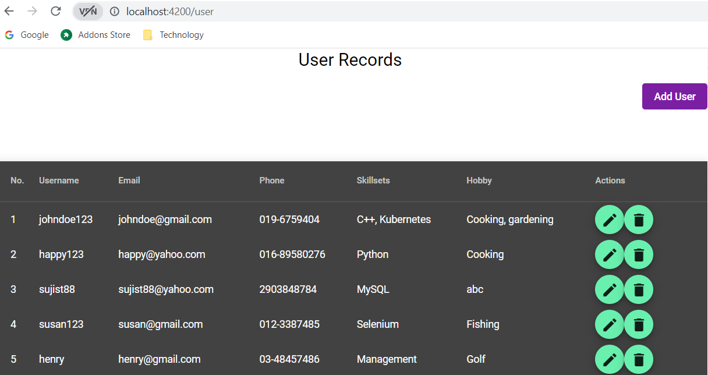
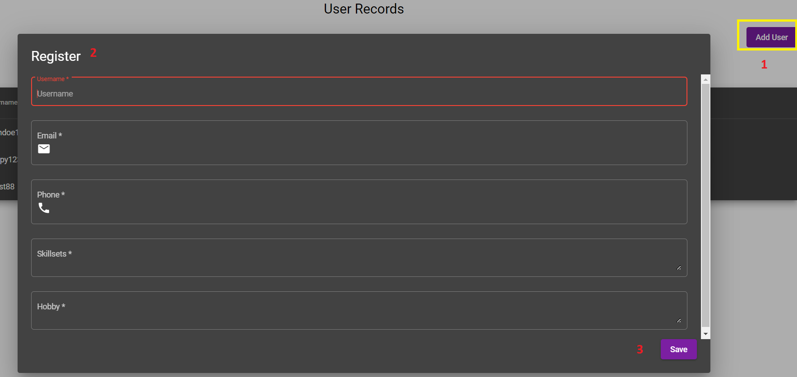
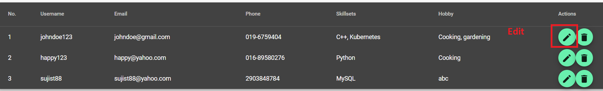
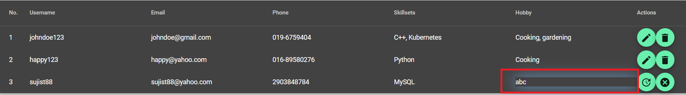
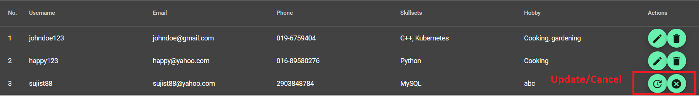
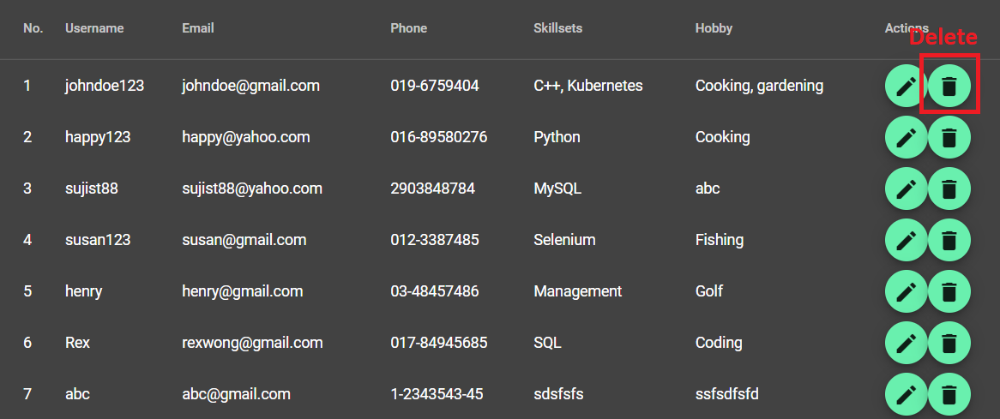
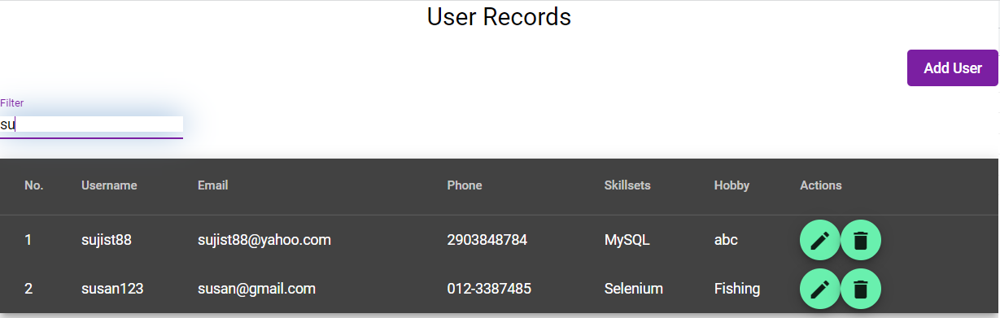

# nestjs-angularjs

## General Information
This project is able to perform CRUD for user records by:
- Registering a new user
- Update user information
- Delete user

## Technology
- Frontend:
  - AngularJS 13.3.3
  - Angular Material
- Backend:
  - Node 16.15.0
  - NestJS 8.10.0
- Database:
  - MongoDB Atlas

## Features
**1. All users**
* Overview of all user records and details will be listed in the main page by retrieving all the information from the database through GET API
http://localhost:4200/user
* Hidden property "**isEdit**" is added into the model of each user. This property shall enable the editable fields for user update later.

**2. New user registration**
* New user is added through the "Add User" button. It is required for the user to provide all the necessary information in order to register the new user.
* User details shall be input in the pop-up dialog box
* User information is then registered into the database through POST API
* The user list table in the main page would refresh with the newly registered user through GET API
* Additional form is applied for the user to populate the required details in the dialog box

**3. Update user information**
* User details update can be done by clicking the edit button for the user row

* The editable field would be enabled when a user row is selected by setting the hidden property "**isEdit**" to true

* The update and cancel buttons would be enabled

* If user decides to cancel user modification, all editable fields would be disabled and the information is reverted to non-modified state earlier. This is done through GET API for all users by retrieving all users list from database again in order to update the table.The non-editable fields are enabled when "**isEdit**" is false.
* User update is performed through PATCH API for specific field's update pertaining to corresponding property
* No update is required to refresh the table again since the field information is updated with the modified details

**4. Delete user**
* User can be deleted through the bin button
* The table is refreshed by updating the local data without getting the updated list from server

**5. Results filter**
* User records can be refined by using the filter on top of the table

